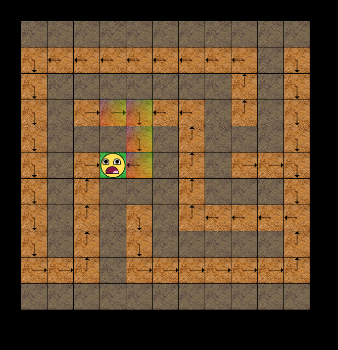

## GridWorld

GridWorld is an environment with discrete states and actions which is suited to simple tabular RL algorithms.  
Most of the inspiration for this environment comes from the lectures within David Silver's 
[RL course](http://www0.cs.ucl.ac.uk/staff/d.silver/web/Teaching.html) and the great [Sutton and Barto book](http://ufal.mff.cuni.cz/~straka/courses/npfl114/2016/sutton-bookdraft2016sep.pdf). 

It is a great environment to test beginner RL algorithms like Dynamic Programming (Policy and Value Iteration), 
other algorithms like Monte-Carlo (MC) Learning and Temporal-Difference (TD) learning, as well as non-RL algorithms like graph search and maze solving.

## Constructor and initialisation

The GridWorld environment is a bidimensional grid of states containing certain entities (initial state, terminal state, walls, etc). 
Each state is represented by an integer to enable tabular RL algorithms (e.g. grid_shape of (4, 4) will be represented by states 0-15).

You can create the default environment like this:

`env = GridWorldEnv()`

This default GridWorld has a grid_shape of (4, 4) i.e. width 4, height 4. 
The agent starts at the top left position and the terminal position's default is set as the last state (bottom right/state index 15). 

Each of these components can be customised e.g. you can specify any rectangle shape you want:

`env = GridWorldEnv(grid_shape=(55, 7))`

You can specify the agent's initial location with an int or a list (for multiple starting locations chosen randomly)

`env = GridWorldEnv(initial_state=1) # or initial_state=[3, 5]`

If an agent ends up in one of the terminal states (i.e. "goal_states" and "lava_states"), 
the episode is over and the agent is unable to move any more. 
The agent receives a large positive reward for a goal state and a large negative reward for a lava state. 
List format is expected e.g. goal_states=[5, 10]. This means that two terminal goal states 
will be placed within the grid, at state indices 5 and 10.

`env = GridWorldEnv(goal_states=[5, 10], lava_states=[10])`

Other options include where to place walls (un-walkable blocked areas):

`env = GridWorldEnv(walls=[7, 8, 10])`

## The main interface: env.step()

To sample a random action from the action_space:

`action = env.action_space.sample()`  
`print(env.action_descriptors[action])`  

action is just an integer from 0-3 representing the actions of going:

`self.action_descriptors = ['UP', 'RIGHT', 'DOWN', 'LEFT] # 0, 1, 2, 3` 

You can also choose an action from the a string by:

`action = self.action_descriptor_to_int['RIGHT'] # returns 1`

The main interface of the agent to the environment is by feeding the environment the chosen action with the env.step(action) function:

`observation, reward, done, info = env.step(action)`  

This will return the new state of the agent in "observation", the "reward" received for doing that action, 
if the environment has terminated ("done") and other "info".  
This how OpenAI gym's environment interface is generally represented.

## Render

`env.render()`

Will render the environment in ASCII format.  

`env.render(mode='graphic')`

Will render the environment with [pyglet](https://bitbucket.org/pyglet/pyglet/wiki/Home) (OpenGL) example below:

`env.render_policy_arrows(policy)`

This will render the policy arrows for a specific policy on the next call to `env.render(mode='graphic')` as shown above in the picture.
The policy must be in the numpy format shape of (env.world.size, env.action_space.n). Examples can be seen in the `examples/gridworld_alg_examples.py` file.

Currently, even if env.render() is never called by the user, it will still be called by the OpenAI gym.Env superclass when the environment is closed. 
This can sometimes cause the program to crash. 

## Other important info

`observation = env.reset()`

Will reset the environment and the agent's position to the start again and return this initial state (if there are multiple initial_states, it is chosen randomly among them). 

`def look_step_ahead(self, state, action):`

This function takes as parameters a state and an action and the next state is returned by the environment. 
This can be used for implementing Dynamic Programming algorithms.

**Agent state**

The agent's state is represented by a single number between 0-N where N is the number of states in the grid.
This makes it easy for tabular matrix algorithms (e.g. Dynamic Programming) to run on the environment.

## Code and Examples

Run the code within  
`examples/gridworld_env_examples.py`  
to see how to use the environment more clearly.  

To see how RL algorithms are run on the environment: 
`examples/gridworld_alg_examples.py`

Explore the implementation of the self-contained environment class (GridWorldEnv) within `core/envs/gridworld_env.py`.

The specific algorithm implementations are within: `core/algorithms/`
